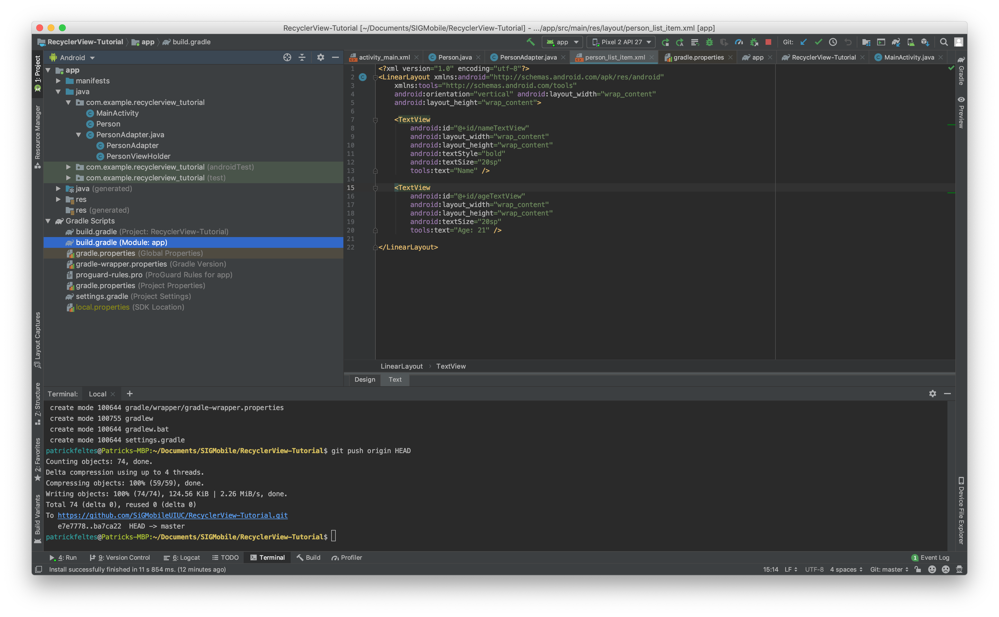

# RecyclerView Tutorial

## What is a RecyclerView?
A pretty common use-case in apps is displaying a list of the same type of item on the screen. For example, displaying restaurants, location options, or songs. Now, what you could do to display a list of items of to just create a View for each of these items and add them to a ScrollView and you'd be done. The problem with this is that it doesn't scale very well. As soon as there are a lot of Views, a lot of memory is eaten up and the app becomes much slower. What a RecyclerView does is binds a dataset to a list of Views, but it will "recycle" the same set of Views so that there are just enough to display what is currently on the screen.

## Getting Started
Open up Android Studio and create a new project. Make sure you check the "Use AndroidX artifacts" button when you are starting up. Here's a screenshot of what it should look like:


Make sure you start with an Empty Activity.

## Gradle Imports
RecyclerView does not come packaged with the Android SDK by default, so we need to add it to our module's `build.gradle` file. You can find it on the left-hand side of Android Studio like in this picture:



Make sure you select the one that says "Module" not the one that says "Project". Then, inside the `dependencies` scope, put this line:

```
implementation 'androidx.recyclerview:recyclerview:1.0.0'
```

It doesn't matter where in the `dependencies` scope, but just try to group it with the other `implementation` commands.

What we're doing by putting this command here is telling Gradle, an Android build system, that we want to include this library in our app. Putting the command here allows Gradle to automatically download and include this library in our app when we run it.

Once you've pasted the command here, make sure to press the Sync button that pops up in the top bar, so that Android Studio knows that we've included the RecyclerView library in our app.

## MainActivity UI
Now that we've included the RecyclerView library, we need to create our UI. Navigate to `activity_main.xml`, which is in the `res/layout/` folder and replace the context with the following:

```XML
<?xml version="1.0" encoding="utf-8"?>
<FrameLayout xmlns:android="http://schemas.android.com/apk/res/android"
    xmlns:tools="http://schemas.android.com/tools"
    android:layout_width="match_parent"
    android:layout_height="match_parent"
    tools:context=".MainActivity">

    <androidx.recyclerview.widget.RecyclerView
        android:id="@+id/recyclerView"
        android:layout_width="match_parent"
        android:layout_height="match_parent">
    </androidx.recyclerview.widget.RecyclerView>

</FrameLayout>
```
Basically, what we're doing here is just creating a screen that holds a RecyclerView. That's all we need to do for the MainActivity UI code.

## RecyclerView List Item UI
Now, we need to also define what each of the items in the list will look like. To do this, create a new file in the `res/layout` folder called `person_list_item.xml` and put the following contents into it:

```XML
<?xml version="1.0" encoding="utf-8"?>
<LinearLayout xmlns:android="http://schemas.android.com/apk/res/android"
    xmlns:tools="http://schemas.android.com/tools"
    android:orientation="vertical" android:layout_width="wrap_content"
    android:layout_height="wrap_content">

    <TextView
        android:id="@+id/nameTextView"
        android:layout_width="wrap_content"
        android:layout_height="wrap_content"
        android:textStyle="bold"
        android:textSize="20sp"
        tools:text="Name" />

    <TextView
        android:id="@+id/ageTextView"
        android:layout_width="wrap_content"
        android:layout_height="wrap_content"
        android:textSize="20sp"
        tools:text="Age: 21" />

</LinearLayout>
```

What we're doing here is just creating a layout of just two TextViews, one displaying a name and the other displaying an age. Each item in our list will just be the name and age of a Person for simplicity sake.

## Data Class
In order to store the data that we want to display in our RecyclerView, let's create a simple class called `Person.java` and put the following code into it:

```Java
public class Person {

    private String name;
    private int age;

    public Person(String name, int age) {
        this.name = name;
        this.age = age;
    }

    public String getName() {
        return name;
    }

    public int getAge() {
        return age;
    }
}
```

This class just holds the name and age of a person.

## RecyclerView Adapter and ViewHolder
Here's where the difficulty comes into play with RecyclerView. In order to use a RecyclerView, we need to do two things:
1. Define a RecyclerView Adapter
2. Define a RecyclerView ViewHolder

The adapter is the mechanism that Android uses to bind the data to the ViewHolders and the ViewHolders are what gets "recycled" by Android. They are what holds the actual UI information. Basically, when you scroll through the RecyclerView, it will use the Adapter to bind whatever the currently needed data is and then display it in a recycled ViewHolder to avoid creating a ton of Views.

Let's create the them. Create a file called `PersonAdapter.java`. Here's the skeleton of it. Please read the comments in this code snippet to understand what each method is doing.
```Java
public class PersonAdapter extends RecyclerView.Adapter<PersonViewHolder> {

    @NonNull
    @Override
    public PersonViewHolder onCreateViewHolder(@NonNull ViewGroup parent, int viewType) {
        // this is where the actual ViewHolder is created and a View is put inside it
        // typically, we create the View by "inflating" it from an XML file
    }

    @Override
    public void onBindViewHolder(@NonNull PersonViewHolder holder, int position) {
        // this method puts the data at position into the given ViewHolder
        // this is also called by the RecyclerView automatically when 
        // scrolling to populate the correct data
    }

    @Override
    public int getItemCount() {
        // this should just return the number of items in the list
        // this helps RecyclerView know what positions are valid
    }
}

class PersonViewHolder extends RecyclerView.ViewHolder {

    // this is the definition of the ViewHolder
    // all it does is hold a View
    public PersonViewHolder(@NonNull View itemView) {
        super(itemView);
    }
}
```

Now, let's fill int he implementation of these two classes. First, let's create a constructor and fields for the PersonAdapter:

```Java
private final List<Person> personList;

public PersonAdapter(List<Person> personList) {
    this.personList = personList;
}
```

All we're doing here is creating a way to actually put a list of people into this Adapter.

Now, let's fill in the `onCreateViewHolder()` method. In this method, all we need to do it actually inflate the XML that we created earlier and then stick it inside a PersonViewHolder. Here's the code:

```Java
@NonNull
@Override
public PersonViewHolder onCreateViewHolder(@NonNull ViewGroup parent, int viewType) {
    View view = LayoutInflater.from(parent.getContext()).inflate(R.layout.person_list_item, parent, false);
    return new PersonViewHolder(view);
}
```

Let's skip the `onBindViewHolder()` implemetation and do `getItemCount()`. This one is just returning the size of the list we passed in:
```Java
@Override
public int getItemCount() {
    return personList.size();
}
```

Now, let's define some stuff in the ViewHolder. First, we need to actually get the two TextViews that we want to put information into. We can use `findViewById()` to do this, so our constructor should now look like this:

```Java
private final TextView nameTextView;
private final TextView ageTextView;

public PersonViewHolder(@NonNull View itemView) {
    super(itemView);

    nameTextView = itemView.findViewById(R.id.nameTextView);
    ageTextView = itemView.findViewById(R.id.ageTextView);
}
```

Now, we just need a way to set the data in these views from outside the class. Let's create a method called `bindData()`. Here's the code:

```Java
public void bindData(Person person) {
    nameTextView.setText(person.getName());
    ageTextView.setText("Age: " + person.getAge());
}
```

Now that we've setup the ViewHolder, we can finish up `onBindViewHolder()`. All we need to do is grab the correct person from the list and call `bindData` with that person on the ViewHolder. Here's the code:

```Java
@Override
public void onBindViewHolder(@NonNull PersonViewHolder holder, int position) {
    Person person = personList.get(position);
    holder.bindData(person);
}
```

All in all, here's what the file should look like:
```Java
public class PersonAdapter extends RecyclerView.Adapter<PersonViewHolder> {

    private final List<Person> personList;

    public PersonAdapter(List<Person> personList) {
        this.personList = personList;
    }

    @NonNull
    @Override
    public PersonViewHolder onCreateViewHolder(@NonNull ViewGroup parent, int viewType) {
        View view = LayoutInflater.from(parent.getContext()).inflate(R.layout.person_list_item, parent, false);
        return new PersonViewHolder(view);
    }

    @Override
    public void onBindViewHolder(@NonNull PersonViewHolder holder, int position) {
        Person person = personList.get(position);
        holder.bindData(person);
    }

    @Override
    public int getItemCount() {
        return personList.size();
    }
}

class PersonViewHolder extends RecyclerView.ViewHolder {

    private final TextView nameTextView;
    private final TextView ageTextView;

    public PersonViewHolder(@NonNull View itemView) {
        super(itemView);

        nameTextView = itemView.findViewById(R.id.nameTextView);
        ageTextView = itemView.findViewById(R.id.ageTextView);
    }

    public void bindData(Person person) {
        nameTextView.setText(person.getName());
        ageTextView.setText("Age: " + person.getAge());
    }
}
```

## Putting data into our RecyclerView
Now that we've done the hard part of setting up the Adapter and ViewHolder, all we need to do is actually put data into our RecyclerView. Go to the `MainActivity.java` file and add to the `onCreate()` method. First, let's create some dummy data to use:

```Java
Person person1 = new Person("Patrick Feltes", 21);
Person person2 = new Person("Jane Doe", 43);
Person person3 = new Person("John Smith", 44);
Person person4 = new Person("Johnny Appleseed", 16);

List<Person> personList = new ArrayList<>();
personList.add(person1);
personList.add(person2);
personList.add(person3);
personList.add(person4);
```

Once we have this data, all we need to do is grab the RecyclerView, create an Adapter and link them up. Here's the code:

```Java
RecyclerView recyclerView = findViewById(R.id.recyclerView);
PersonAdapter adapter = new PersonAdapter(personList);
recyclerView.setLayoutManager(new LinearLayoutManager(getApplicationContext()));
recyclerView.setAdapter(adapter);
```

We also set a LayoutManager, so that the ReycclerView is rendered top-to-bottom. Here's what the MainActivity code will look like all together:

```Java
public class MainActivity extends AppCompatActivity {

    @Override
    protected void onCreate(Bundle savedInstanceState) {
        super.onCreate(savedInstanceState);
        setContentView(R.layout.activity_main);

        Person person1 = new Person("Patrick Feltes", 21);
        Person person2 = new Person("Jane Doe", 43);
        Person person3 = new Person("John Smith", 44);
        Person person4 = new Person("Johnny Appleseed", 16);

        List<Person> personList = new ArrayList<>();
        personList.add(person1);
        personList.add(person2);
        personList.add(person3);
        personList.add(person4);

        RecyclerView recyclerView = findViewById(R.id.recyclerView);
        PersonAdapter adapter = new PersonAdapter(personList);
        recyclerView.setLayoutManager(new LinearLayoutManager(getApplicationContext()));
        recyclerView.setAdapter(adapter);
    }
}
```

Now, if we run the app, we should see something like this:


If you add more items to the list, it will go off the screen and then you'll be able to scroll through them. Thanks for following along!